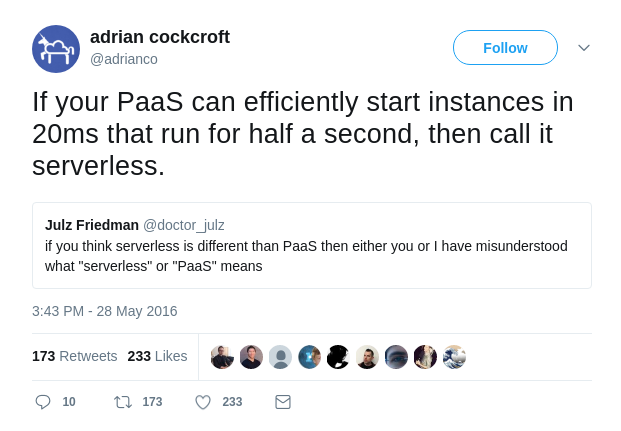

# #serverless
# durch die Nacht

Stefan Siegl (@stesie23, <rolf@mayflower.de>)

<!--s-->

aber da sind doch Server!

<!--v-->

ja, aber sie interessieren dich nicht mehr!

und du kannst dich auch gar nicht darauf einloggen, auch wenn du es wollen würdest  <!-- .element: class="fragment" -->

<!--v-->

# Function as a Service

... auch nicht viel besser <!-- .element: class="fragment" -->

<!--v-->

weil es geht nicht nur um eine einzelne Funktion

<!--v-->

vielmehr um einen kleinen (micro) service

<!--v-->

# Serverless Framework

<!--v-->

tolles Tool, ...

aber halt ein Tool und kein Framework <!-- .element: class="fragment" -->

<!--s-->



<!--s-->

> AWS Lambda ist ein serverloser Datenverarbeitungsservice, der Ihren Code beim
> Eintreten bestimmter Ereignisse ausführt und automatisch für Sie die zugrunde
> liegenden Datenverarbeitungsressourcen verwaltet

<cite>(Quelle https://aws.amazon.com/de/lambda/details/)</cite>

<!--s-->

# TL;DR

* Code hinwerfen
* Trigger definieren
* Plattform kümmert sich um Skalierung
* Pay as you Go

<!--s-->

# Hello World

```javascript
exports.handler = (event, context, callback) => {
    callback(null, {
        statusCode: 200,
        body: JSON.stringify({
            'message': 'Hello World',
            'eventData': event
        })
    });
};
```

<!--s-->

# Ereignis?

<ul class="fragment">
  <li>Datei/Objekt in S3 hochgeladen</li>
  <li>Schreibzugriff auf DynamoDB</li>
  <li>Meldung auf SNS Topic</li>
  <li>HTTP Request auf API Gateway</li>
  <li>Alexa Intent</li>
  <li>Lambda@Edge Request</li>
  <li>uvm.</li>
</div>

<!--v-->

# Runtimes

* Java 8
* C#
* Node 4.3 + 6.10
* Python 2.7 + 3.6
* Go

<!--v-->

# Pay as you go

* Anzahl Anforderungen
* zzgl. Laufzeit nach angefangenen 100ms
  (Startup-Time + Request-Verarbeitung)

<!--v-->

# free tier

* 1 Mio. Anforderungen
* 400 000 GB/s Laufzeit

<!--v-->

# Pricing .de aktuell

* 0,0000002 USD pro Anfrage
* 0,00001667 USD pro GB/s

<!--v-->

# RAM vs. Performance

* RAM in Schritten wählbar zwischen 128 MB und 3 GB
* CPU-Leistung proportional zu RAM

<!--v-->

# Timeouts

* Lambda hat max. Laufzeit <br>(konfigurierbar, Standard 3s, max. 300s)
* API Gateway hat Timeout von 29s

<!--v-->

## Startup-Zeit JVM (Spring)

### bei 512 MB

* Billed Duration: 11200 ms
* Max Memory Used: 107 MB

### bei 192 MB

* Billed Duration: 26100 ms
* Max Memory Used: 105 MB

<!--v-->

# Demo

<!--s-->

# what about node_modules...

* eigene Module, Repositories, Services, ...
* Webpack Plugin
* TypeScript Plugin

<!--v-->

* viele HTTP-Request-Routen, viele Lambdas?
* geteilter Code zwischen mehreren Routen?
* eine Lambda für ein ganzes CRUD Repository <br>
  (nicht für jede einzelne Route)
* aws-serverless-express
* vs. "per route" security config


<!--s-->

# awesome <br>pay as you go

<!--v-->

# API Gateway

* REST Schnittstelle
* Authorization
* Request Throtteling
* API Keys
* Caching

<!--v-->

# S3

* Object Store (nicht nur Dateiablage)
* ... kann auch billiger Key/Value Store sein
* aufpassen auf Latenz

<!--v-->

# DynamoDB

* NoSQL Datenbank als REST-Service
* Zugriff auf Tabellen via Partition Key
* optional Range/Sort Key
* read/write muss provisioniert werden
* minimale "Dauerkosten"

<!--v-->

# Cognito User Pool

* Authentication as a Service
* entweder eigener User Pool (als Service verwaltet),
  oder federated (Google, Facebook, Twitter, etc.)
* Validierung e-mail und 2FA/SMS
* optional: Web Login-Maske (OAuth 2)

<!--v-->

# Cognito IoT Broker

* kann man für Pub/Sub (Web Sockets) verwenden

<!--v-->

# SNS

* Notifications auf Topics
* Lambdas können Topics subscriben
* asynchrone Tasks können 1:n, n:m, angehängt werden

<!--v-->

# SES

* E-Mail Versand as a Service

<!--s-->

# andere Architektur

* Backend rückt näher ans Frontend
* kostenersparnis, wenn Middleware wegfällt
* alte Plattform 1:1 übernehmen ergibt keinen Sinn

<!--s-->

# Sonstiges

* AWS SAM (Serverless Application Model)
* aws-sam-local
* Serverless Application Repository

<!--s-->

# Fragen?

* E-Mail: <rolf@mayflower.de>
* Twitter: @stesie23